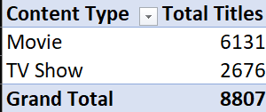

# Netflix Content Analysis
> Status: In Progress | Started July 2026 | Target: July 14, 2026 - [Extended date: July 23, 2026]

---

## About 
**Analyst:** Kushagra Yadav  
**Tools:** Python | SQL | Power BI | Excel | Git  
**Dataset:** 8,807 Netflix titles | Added to Netflix 2008–2021 (content spans original release years as far back as 1925)

---

## Objective
To analyze Netflix's content library and uncover key insights around content type distribution, country-wise production, genre trends, and yearly growth -  with actionable recommendations for content strategy.

--- 

## Tools Used
- **Python** (Pandas, Matplotlib, Seaborn) - Data cleaning, EDA, visualization
- **SQL** (SQLite) - Business queries and aggregations
- **Power BI** - Interactive dashboard
- **Excel** - Quick pivot table analysis
- **Git & GitHub** - Version control

--- 

## Dataset
- **Source:** Kaggle - Shivam Bansal 
- 8,807 Netflix titles
- **12 columns:** show_id, type, title, director, cast, country, date_added, release_year, rating, duration, listed_in, description
- **Release year range:** 1925 to 2021  
- **Added to Netflix:** 2008 to 2021

---

## Excel Quick Analysis
Quick pivot table showing Movies vs TV Shows distribution:

*Pivot table showing Movies vs TV Shows split*

| Content Type | Total Titles |
|------------- |------------- |
| Movie        |        6,131 |
| TV Show      |        2,676 |
| **Total**    |     **8,807**|

*(Note: figures above are pre-cleaning counts from the raw Excel pivot; post-cleaning totals are 6,126 Movies / 2,664 TV Shows - see notebook for details.)*

---

## Business Questions This Project Will Answer
- Which country produces the most Netflix content?
- What is the ratio of Movies vs TV Shows on Netflix?
- Which genres dominate the Netflix library?
- How has Netflix grown its content library year over year - especially during COVID (2019–2021)?
- What content ratings are most common and what does that say about Netflix's target audience?

---

## Project Structure
- `netflix_titles.xlsx` - Raw dataset
- `Netflix_Excel_Analysis.csv` - Excel pivot table analysis
- `Netflix_Cleaned.csv` - Cleaned dataset 
- `excel_pivot.png` - Pivot table screenshot
- `Netflix_analysis.ipynb` - Full analysis notebook
- `charts/` - Visualization Images
- `.gitignore` - Excludes unnecessary files

---

## Progress
- [x] Dataset downloaded and loaded
- [x] Excel pivot table analysis done
- [x] Data structure and null values checked
- [x] Business questions defined
- [x] Null handling strategy documented
- [x] Data cleaning (Python)
- [x] EDA and visualizations
- [x] SQL queries
- [ ] Power BI dashboard 
- [ ] Business insights write-up 